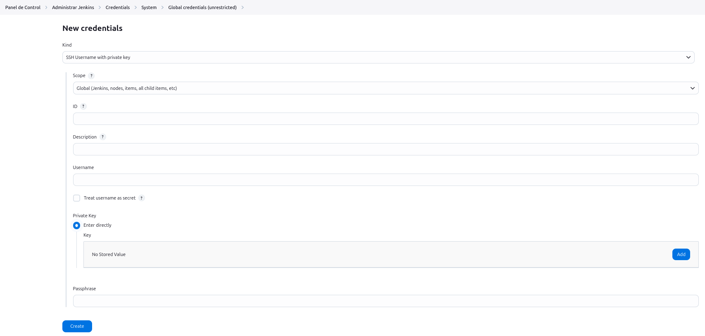
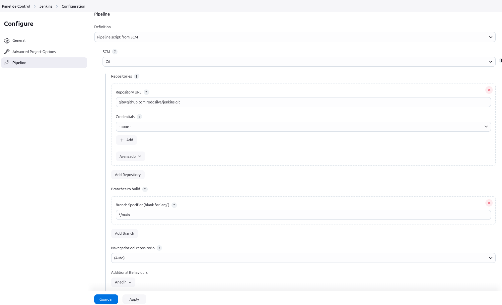

# Jenkins
Jenkins y Pipelines BootCamp de Codigo Facilito

## Seteando el Entorno
1. Primero, corremos un `docker compose up` usando [docker-compose.yml](./docker/docker-compose.yml).
Con esto estaremos levantado un `Jenkins` usando el puerto `8080`

2. Para conectar `Jenkins` con `Github` la Key privada debemos ir `Panel de Control - Administrar Jenkins - Credentials - System - Global credentials (unrestricted)`

3. La llave pública se colocará en [Deploy Keys](https://github.com/rodosilva/jenkins/settings/keys)

4. Para que no pida confirmaciones al momento de generar la comunicación `ssh` desde `Jenkins` deberemos:
`ssh-keyscan -t ed25519 github.com >> /var/jenkins_home/.ssh/known_hosts`

5. Para las configuraciones del `Pipeline` debemos colocar el repositorio de GitHub aquí:
`Panel de Control - Jenkins - Configuration` 

## Descripción de Archivos
- [docker-compose.yml](./docker/docker-compose.yml): Archivo encargado de construir el contenedor de `Jenkins` utilizando el [Dockerfile](./docker/Dockerfile)
- [Dockerfile](./docker/Dockerfile): Archivo con las instruciones para la construcción de la Imagen de `Jenkins`
- [Jenkinsfile](./Jenkinsfile): Archivo con las instrucciones del Pipeline entre las cuales está el `build` de `PHP` utilizando el [Dockerfile](./Dockerfile)

## Plugins

### Slack
Se encuentra el `Panel de Control - Administrar Jenkins - System` siempre y cuando el Plug-In ya haya sido instalado.

Las credenciales son del tipo `Secret Text` donde vamos a añadir el valos mencionado en [Jenkins CI](https://rodo-devops.slack.com/services/B086L9SC5HQ?added)

## Agentes
El servidor que queremos que sea usado como Agente de `Jenkins` deberá llevar la llave pública en `~/.ssh/authorized_keys`

Por otro lado `Jenkins` tendrá la llave privada.

Finalmente en `Panel de Control - Administrar Jenkins - nodos` deberemos añadir `Nuevo Nodo`
Ahí definimos el `Directorio raiz remoto` que es el `Home` donde se almacenará todos los documentos Jenkins. Ejemplo: `/home/ubuntu`

Deberemos seguir también el mismo paso de añadir al `Known_hosts` visto en [Seteando el Entorno](#seteando-el-entorno)

